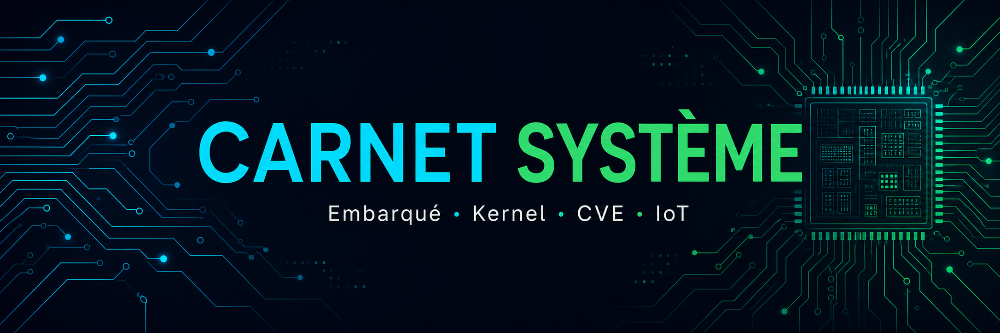

# 👋 Moi, ingénieur système & embarqué

**Je documente le bas-niveau : kernels, firmware, drivers, protocoles IoT — et les CVE qui les secouent.**

---

## 🧭 Qui suis-je

Ingénieur spécialisé en **systèmes d'exploitation et systèmes embarqués**. Je passe mes journées entre
du C, des traces de scheduler, des trames MQTT et des diffs de patchs kernel. Ce profil est la vitrine
de mes recherches : j'apprends en public, un article par semaine.

- 🔭 **En ce moment** : série sur l'ordonnanceur Linux (CFS → EEVDF) et analyse de CVE kernel historiques
- 🌱 **J'apprends** : Rust pour drivers kernel, RTOS (Zephyr), Matter/Thread
- 💬 **Demande-moi** : Linux, Windows kernel, Android, firmware, MQTT/CoAP, analyse binaire

---

## 🛠️ Compétences

Reverse : `Ghidra` · `radare2` · `GDB` · `binwalk` · `Frida` — Analyse : `eBPF` · `ftrace` · `Perf` · `Wireshark`

---

## 📚 Mes séries de recherche

| Série | Contenu | Statut |
|---|---|---|
| 🧠 **[Kernel & OS](https://github.com/<ton-pseudo>/carnet-systeme/tree/main/site/docs/articles)** | Ordonnanceur, syscalls, mémoire, drivers Linux/Windows, Android (Binder/HAL), XNU | 🚧 1/10 |
| 🔧 **[Embarqué & Firmware](https://github.com/<ton-pseudo>/carnet-systeme)** | Chaîne de boot, device tree, firmware extraction, RTOS, périphériques | 🚧 0/10 |
| 🕵️ **[CVE Analysis](https://github.com/<ton-pseudo>/carnet-systeme)** | Writeups structurés : root cause → exploitabilité → patch → leçons | 🚧 1/12 |
| 📡 **[Protocoles IoT](https://github.com/<ton-pseudo>/carnet-systeme)** | MQTT, CoAP, Zigbee, BLE, LoRaWAN, Matter — format des trames & sécurité | 🚧 1/10 |

➡️ **Tout lire sur [mon carnet](https://<ton-pseudo>.github.io/carnet-systeme/)**

---

## 📝 Dernières publications

<!-- Tiens ce tableau à jour : une ligne = un article -->

| Date | Article | Série |
|---|---|---|
| 2026-09-12 | Dirty COW (CVE-2016-5195) — anatomie d'une course de 9 ans | CVE Analysis |
| 2026-09-12 | L'ordonnanceur Linux, partie 1 : CFS sans douleur | Kernel & OS |
| 2026-09-12 | MQTT pour l'embarqué : le protocole qui fait parler les objets | Protocoles IoT |

---

## ⚙️ Mon lab

- 🖥️ VM/QEMU (x86_64, ARM64) · Raspberry Pi · cartes STM32/ESP32
- 🐧 Kernel custom + BusyBox, kgdb, QEMU -s -S
- 🔬 Stack d'analyse : Ghidra, binwalk, Frida, Wireshark, YARA

---

## 📫 Me contacter

- 💼 LinkedIn : [linkedin.com/in/<ton-pseudo>](https://www.linkedin.com/in/<ton-pseudo>/)
- ✉️ `<ton.email@exemple.com>`

*« Le meilleur moyen de maîtriser un système, c'est de l'expliquer. »*

