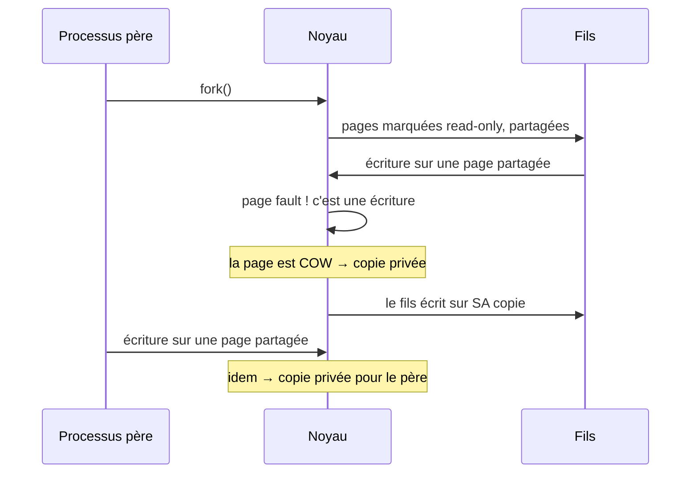

> ⚖️ *Cet article analyse une vulnérabilité **publique et corrigée depuis 2016**, à des fins pédagogiques.
> Tout test doit se faire dans une machine virtuelle isolée qui t'appartient, sans correctif.*

## Carte d'identité

| Champ | Valeur |
|---|---|
| CVE | **CVE-2016-5195** |
| Nom usuel | **Dirty COW** |
| CVSS | 7,2 (v2, NVD) — 7,8 (v3.1, NVD) |
| Type | Condition de course (race condition) sur la copy-on-write |
| Composant | Noyau Linux — sous-système mémoire (`mm/gup.c`) |
| Versions affectées | 2.6.22 (sept. 2007) → corrigé dans 4.8.3, 4.7.9, 4.4.26 et backports |
| Corrigé le | 18–19 octobre 2016 |
| Commit du fix | [`4ceb5db9757a`](https://git.kernel.org/pub/scm/linux/kernel/git/torvalds/linux.git/commit/?id=4ceb5db9757aa69c) — « mm: remove gup_flags FOLL_WRITE games from `__get_user_pages()` » |
| Découverte | Phil Oester, octobre 2016, en analysant un **exploit trouvé in the wild** |

## TL;DR

- Une course dans la gestion de la copy-on-write permettait à **n'importe quel utilisateur local non privilégié d'écrire dans un fichier lisible en lecture seule** (typiquement : `/etc/passwd`, un binaire `setuid`), donc de **devenir root**.
- Le bug a vécu **~9 ans** dans le noyau (depuis 2.6.22, 2007) — il était donc présent sur des centaines de millions de machines, serveurs, Android et objets connectés.
- C'est un cas d'école parfait : une course *très* subtile dans une API centrale (`get_user_pages()`), un patch minuscule, et des conséquences énormes.

## Contexte : copy-on-write en 90 secondes

Linux partage les pages physiques entre processus pour économiser la RAM. Quand un `fork()` duplique un processus, les deux partagent les **mêmes pages** tant que personne n'écrit. C'est la **copy-on-write (COW)** :



Autre morceau du puzzle : `mmap()` avec `MAP_PRIVATE` crée une mapping **privé** d'un fichier. On peut **lire** les pages (elles viennent du page cache), et si on écrit dessus, le noyau est censé faire une copie privée — jamais modifier le fichier lui-même.

Dernier ingrédient : `/proc/self/mem` permet, en cherchant dans cette interface, de **lire/écrire la mémoire d'un processus** en passant par le noyau. C'est légitime (les debuggers s'en servent), et ce chemin utilise `get_user_pages()`.

## Root cause : le drapeau `FOLL_WRITE` qui disparaît

Quand le noyau écrit « pour le compte » d'un processus via `get_user_pages()` (GUP), il transmet le drapeau `FOLL_WRITE` pour dire « je veux écrire ». Sur une mapping privée en lecture seule, GUP doit donc déclencher la COW : *fault*, copie privée, et on réécrit.

Le problème est dans la **revalidation**. En cas de contention ou de `VM_FAULT_RETRY`, GUP repasse derrière et doit se souvenir qu'une écriture était demandée. Or le code historique se fiait à un état fragile du PTE : si la page était sale/dirty, on considérait que la COW « était déjà passée » (drapeau `FOLL_COW`) — et on retournait **la page du page cache partagée**, sans copie privée.

Concrètement, la course gagnante ressemblait à ceci :

1. Un thread ouvre `/etc/passwd` (ou un binaire `setuid`) en lecture seule, `mmap` `MAP_PRIVATE`, `PROT_READ`.
2. Un thread appelle en boucle `madvise(map, len, MADV_DONTNEED)` — « jette ces pages, je repartirai du fichier ».
3. Un thread cherche l'adresse mappée dans `/proc/self/mem` et tente une écriture, en boucle.
4. À un instant donné, l'écriture par `/proc/self/mem` tombe pile dans la fenêtre où GUP croit que la COW a déjà eu lieu → le noyau écrit dans **la page du page cache**… donc dans le fichier sur disque. ⚡

Le contenu du fichier est modifié, alors que le processus n'a **aucun droit en écriture** dessus. Il ne reste qu'à écrire une ligne dans `/etc/passwd` (un compte root sans mot de passe) ou à patcher un binaire `setuid` pour obtenir root.

## Conditions d'exploitation

- **Accès local** non privilégié au système vulnérable (shell, ou exécution de code dans une app).
- Le fichier cible doit être **lisible** par l'attaquant (lecture seule suffit) — c'était le cas de `/etc/passwd` sur énormément de systèmes, y compris Android.
- Pas besoin de `ptrace` ni de capability : tout passe par `/proc/self/mem` du **propre** processus.
- Fiabilité : les PoC publics tournaient en quelques secondes (la fenêtre de course est large sur noyau non patché).
- **Non affecté** : noyaux ≥ 4.8.3 / 4.7.9 / 4.4.26 et leurs backports distribution (les distros enterprise ont patché dès octobre 2016).

## Reproduction pédagogique (lab isolé)

> Le PoC historique (`dirtyc0w.c` de l'équipe qui a coordonné la divulgation) tient en ~50 lignes.
> Version minimale et commentée de la mécanique :

```c
/* Principe (VM sans correctif uniquement) :
 * thread A : écrit "HACKED" via /proc/self/mem sur le mapping
 * thread B : madvise(MADV_DONTNEED) en boucle pour relancer la course */
void *map = mmap(NULL, st.st_size, PROT_READ, MAP_PRIVATE, fd, 0);

/* thread B */
while (1)
    madvise(map, 100, MADV_DONTNEED);   /* jette les pages COW en boucle */

/* thread A */
int f = open("/proc/self/mem", O_RDWR); /* la fenêtre de course est ici */
while (1) {
    lseek(f, (uintptr_t)map, SEEK_SET);
    write(f, patch, strlen(patch));     /* l'écriture « COWée » qui rate sa copie */
}
```

Sur un noyau vulnérable, après quelques secondes : le fichier (ex. `/etc/passwd`) contient la chaîne injectée alors que l'utilisateur n'a **jamais** eu le droit d'y écrire :

```text
$ cat /etc/passwd | tail -1
foo:HACKED::0:0::/:/bin/sh        ← le fichier read-only a été modifié
```

## Le correctif (patch review)

```diff
--- a/mm/gup.c
+++ b/mm/gup.c
@@ static int can_follow_write_pte(...)
-    /* s'appuyait sur l'état dirty/FOLL_COW du PTE :
-       « la COW a déjà eu lieu, donc je peux réécrire » */
-    if ((flags & FOLL_WRITE) && !can_follow_write_pte(pte, flags))
+    /* exige explicitement FOLL_FORCE | FOLL_WRITE et une VMA
+       réellement écrivable : plus de « jeux » sur les drapeaux */
+    if ((flags & FOLL_WRITE) &&
+        !can_follow_write_pte(pte, flags)) {
             return NULL;
+    }
```

L'idée du fix (Linus Torvalds, commit `4ceb5db9757a`) : **ne plus laisser `__get_user_pages()` « jouer » avec les drapeaux** selon des états de PTE implicites. Une écriture forcée doit être un contrat explicite (`FOLL_FORCE`), pas une déduction fragile. Le patch est minuscule — comme souvent pour les races une fois qu'on a *compris*.

## Mitigations & détection

- **Corriger** : kernel ≥ 4.8.3 / 4.7.9 / 4.4.26, ou les backports des distros (octobre 2016). C'est la seule vraie solution.
- Contournement historique Red Hat (avant patch) : réduire `vm.dirty_writeback_centisecs` + vider les caches — dégradait les perfs, pleine de caveat, à considérer comme pedagogique uniquement.
- **Android** : corrigé via le bulletin de sécurité d'octobre 2016 — mais une majorité d'objets connectés/Android d'époque n'ont **jamais** reçu la mise à jour. Des appareils vulnérables tournent encore aujourd'hui.
- Détection (post-mortem) : intégrité des binaires setuid, vérification des fichiers systèmes (dpkg `--verify`, AIDE, tripwire).

## Les leçons

- **Pour les développeurs noyau** : les API comme GUP doivent porter des contrats explicites. Les « optimisations » basées sur des états implicites (un bit dirty, un flag déduit) sont un terrain de chasse à races.
- **Pour les defenders** : un bug local d'escelade de privilèges dans le noyau = game over sur un système multi-utilisateurs ; et sur l'IoT, c'est pérenne car ces systèmes ne sont presque jamais patchés.
- **Pour moi** : la modernité d'un bug ne fait pas sa dangerosité — celui-ci avait 9 ans. Et sa découverte vient d'un **échantillon in the wild** : les chercheurs qui regardent ce qui circule réellement font de la veille précieuse.

## Références

- [Advisory Ubuntu / announcement officielle Dirty COW (dirtycow.ninja, archive)](https://dirtycow.ninja/)
- [Red Hat — CVE-2016-5195](https://access.redhat.com/security/cve/cve-2016-5195)
- [Commit du fix : `4ceb5db9757a`](https://git.kernel.org/pub/scm/linux/kernel/git/torvalds/linux.git/commit/?id=4ceb5db9757aa69c)
- [NVD — CVE-2016-5195](https://nvd.nist.gov/vuln/detail/cve-2016-5195)

---

*Analyse publiée le 12 septembre 2026. Une imprécision ? [Écris-moi](../a-propos.md).*
