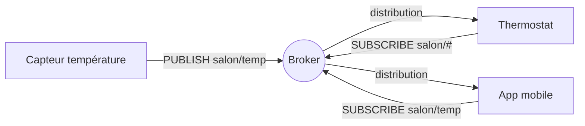
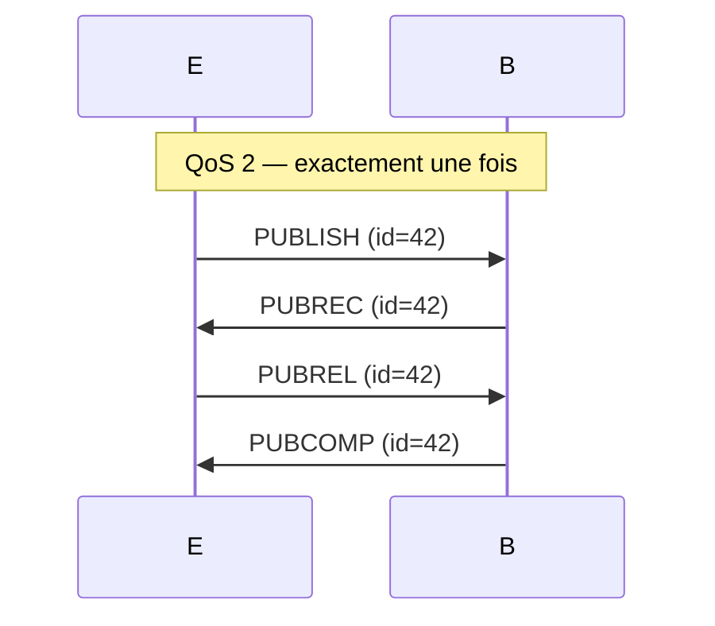

## TL;DR

- **MQTT** est le protocole de messagerie **publish/subscribe** roi de l'IoT : léger (2 octets d'entête minimal), pensé pour les réseaux peu fiables, avec trois niveaux de qualité de service.
- Un broker central distribue les messages par **topics** ; les appareils ne se connaissent pas entre eux.
- À la fin de cet article tu sauras monter un broker, capturer des trames et choisir les bonnes options pour un objet embarqué.

## Sa place dans la pile

```text
Application  ← MQTT vit ici (par-dessus TCP !)
Transport    TCP 1883 (clair) / TLS 8883 (mqtt(s))
Réseau       IPv4 / IPv6
Liaison      Wi-Fi, Ethernet, cellulaire...
```

MQTT suppose un **transport fiable** (TCP). Pour les nœuds trop contraints pour TCP, il existe **MQTT-SN** (sur UDP) — un futur article. Ses contraintes cibles : empreinte mémoire minuscule, batterie, latence modérée, fiabilité ajustable.

## Modèle de communication : pub/sub et découplage

Contrairement à HTTP (client → serveur), MQTT est **publish/subscribe** : les clients se connectent à un **broker** et publient ou s'abonnent à des **topics**. Personne ne parle jamais directement à personne.



Trois découplages fondamentaux : **d'espace** (émetteur/récepteur ne se connaissent pas), **de temps** (ils ne sont pas connectés en même temps — avec les messages retenus), **de synchronisation** (pas de blocage en attente de réponse).

## Format des messages (sur le fil)

Chaque paquet MQTT commence par un **fixed header** de 2 octets minimum — c'est ça, la légèreté :

```text
octet 0 :  [ type (4 bits) | drapeaux (4 bits) ]
octet 1 :  longueur restante (encodage variable 1 à 4 octets)
puis...  :  payload
```

| Type | Valeur | Rôle |
|---|---|---|
| CONNECT / CONNACK | 1 / 2 | ouverture de session |
| PUBLISH | 3 | publier un message |
| SUBSCRIBE / SUBACK | 8 / 9 | s'abonner |
| PINGREQ / PINGRESP | 12 / 13 | keep-alive |
| DISCONNECT | 14 | fermeture propre |

Un message de 2 octets d'entête pour publier `"21.5"` : c'est possible. À comparer aux centaines d'octets d'une requête HTTP typique — sur un réseau GSM avec facturation au Ko, ça change la vie.

## Les mécanismes clés

### 1. Topics et wildcards

Les topics sont des arborescences (`maison/salon/temperature`). Deux jokers côté **abonnement** :
- `+` : un niveau (`maison/+/temperature` → salon, cuisine…)
- `#` : tous les niveaux suivants (`maison/#`)

⚠️ Les wildcards ne sont **pas** autorisés à la publication — uniquement à l'abonnement.

### 2. Les QoS : trois niveaux de livraison

| QoS | Garantie | Mécanisme | Coût |
|---|---|---|---|
| 0 | au plus une fois | fire and forget | minimal |
| 1 | au moins une fois | PUBLISH → PUBACK (reprise sur DUP) | doublons possibles |
| 2 | exactement une fois | handshake en 4 temps (PUBREC/PUBREL/PUBCOMP) | le plus lourd |



**Piège classique :** choisir QoS 2 « pour être sûr ». Sur un capteur batterie, QoS 1 + idempotence côté application est souvent le bon compromis.

### 3. Retained messages

`retain=1` : le broker **stocke** le dernier message du topic et le repousse à tout nouvel abonné. Parfait pour l'état courant (« la vanne est fermée ») : un client qui se connecte 3 h plus tard connaît l'état sans attendre le prochain événement.

### 4. Last Will and Testament (LWT)

À la connexion, le client laisse un **testament** : « si je me déconnecte brutalement, publie `device/42/status = offline` ». C'est LA mécanique de supervision d'IoT : le backend sait qu'un capteur est mort sans qu'il ait besoin de le dire.

### 5. Keep-alive

Le client promet d'émettre au moins un octet toutes les *N* secondes (PINGREQ sinon). Le broker déclare mort un client silencieux après 1,5 × keep-alive → déclenche le LWT.

### 6. MQTT 3.1.1 vs 5.0

La v5 apporte ce qui manquait aux années 2010 : **codes de raison** (fini lesCONNACK muets), **propriétés** (expiration de message, alias de topic pour compresser encore), **session expiry** négociable, **abonnements partagés** (load balancing entre consommateurs), user properties (métadonnées clé/valeur). En embarqué, beaucoup de stacks ne parlent encore que 3.1.1 : à vérifier avant de concevoir.

## Sécurité

| Menace | Contre-mesure dans le protocole/stack | Ce qu'il reste à faire côté dev |
|---|---|---|
| Écoute passive | TLS (8883) | provisionnement des certificats CA |
| Usurpation de client | auth par login/mot de passe ou **certificat client (mTLS)** | stockage sécurisé des secrets (secure element, MCU flash protégée) |
| Publication/abonnement sauvage | ACL côté broker (topic → client) | concevoir les topics avec des IDs non devinables |
| Client fantôme (toujours connecté) | keep-alive + LWT | supervision côté backend |

**Les erreurs de terrain qu'on voit partout :**
1. Broker ouvert sur Internet sans auth (des dizaines de milliers de brokers MQTT sont ouverts en ce moment — scanne Shodan pour t'en convaincre).
2. TLS désactivé « le temps des tests » et jamais réactivé.
3. Topics prévisibles (`home/#`) + ACL absentes → n'importe quel client lit tout.
4. Identifiants en dur dans le firmware → extraction du flash et c'est fini.

## Lab : observer et manipuler (10 minutes)

```bash
# 1. Installer un broker local + les clients CLI
$ sudo apt install mosquitto mosquitto-clients

# 2. Terminal 1 — s'abonner à tout, verbose
$ mosquitto_sub -h localhost -t 'demo/#' -v

# 3. Terminal 2 — publier (QoS 1, message retenu)
$ mosquitto_pub -h localhost -t 'demo/salon/temp' -m '21.5' -q 1 -r

# Sortie terminal 1 :
demo/salon/temp 21.5
```

Maintenant **capture la trame** pour voir le protocole à l'octet près :

```bash
$ sudo tcpdump -i lo -X port 1883 -c 4
0x0000:  3020 000e 6465 6d6f 2f73 616c 6f6e 2f74    0 ...demo/salon/t
0x0010:  656d 7032 312e 35                            emp21.5
```

**Lecture octet par octet :** `0x30` = PUBLISH (type 3), QoS 0, retain=0 ; `0x20` = longueur restante (32) ; puis la longueur du topic (2 octets), le topic, et le payload `21.5`. Tu viens de *voir* MQTT.

Enfin, un client embarqué minimal en Python (même logique en C avec Paho/coreMQTT) :

```python
import paho.mqtt.client as mqtt

def on_connect(c, _u, _f, rc):   # reconnexion → se réabonner
    c.subscribe("demo/#", qos=1)

c = mqtt.Client(client_id="capteur-01", protocol=mqtt.MQTTv311)
c.on_connect = on_connect
c.username_pw_set("capteur", "mot-de-passe-fort")
c.tls_set()                      # en prod : cafile + client cert (mTLS)
c.connect("broker.exemple.fr", 8883)
c.publish("demo/salon/temp", "21.5", qos=1, retain=True)
```

## Comparaison rapide

| | MQTT | CoAP | HTTP/REST |
|---|---|---|---|
| Modèle | pub/sub | req/réponse (UDP) | req/réponse |
| Transport | TCP | UDP (+DTLS) | TCP |
| Empreinte | très faible | minuscule | lourde |
| Push natif | ✅ (broker) | observe (limité) | non (polling) |
| Écosystème | immense (broker partout) | plus niche | universel |

**Règle de pouce :** beaucoup d'appareils qui poussent des états → MQTT. Un capteur qui dort et répond à des requêtes sur du 6LoWPAN → CoAP. Une intégration web ponctuelle → HTTP.

## Implémentations de référence

- **Clients embarqués** : Eclipse Paho (C/Python/Java), coreMQTT (AWS, certifié), Mongoose, ThingSet…
- **Brokers** : Mosquitto (référence légère), EMQX, NanoMQ, HiveMQ, Vernierq
- **Outils de test** : mosquitto_sub/pub, MQTT Explorer, Wireshark (dissecteur MQTT natif)

## Pour aller plus loin

- [Spécification OASIS MQTT 5.0](https://docs.oasis-open.org/mqtt/mqtt/v5.0/os/mqtt-v5.0-os.html)
- [MQTT.org — FAQ officielle](https://mqtt.org/faq/)
- Article suivant de la série : *CoAP vs MQTT : quand choisir quoi* (à venir)

---

*Corrigé le 12 septembre 2026. Une erreur ? [Écris-moi](../a-propos.md).*
